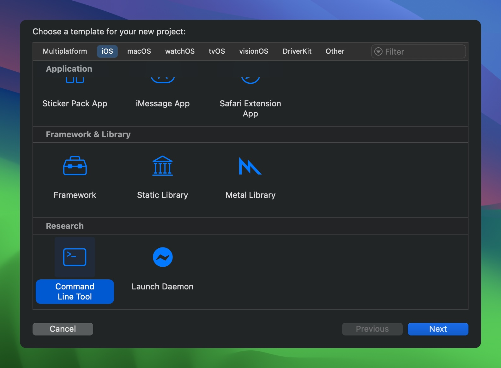

> Disclaimer: this project is provided for use within the [Apple Security Research Device Program](https://security.apple.com/research-device/), use for any purpose outside of security research is outside the scope of the project, please don't report issues or request features that are not within that scope.

# SRD Xcode Templates

This repository provides Xcode templates to facilitate development of custom tools for the SRD, with settings that configure the targets for easy deployment with a research cryptex.

- **Command Line Tool**: template for an adhoc-signed iOS cli executable
- **Launch Daemon**: template for an adhoc-signed iOS launch daemon

## Installation

Note: all templates are configured to use my custom [research SDK](https://github.com/insidegui/researchsdk), if you'd like to use the regular iOS SDK, you can change the build settings after creating your project.

To install the templates, just clone the repo and run the `install` script, or manually copy the `Templates/Research` folder into `~/Library/Developer/Xcode/Templates/`.

Restart Xcode after installing the templates.

## Using the templates

To create a new project with one of the templates, just go to `File > New > Project`, you'll find the templates in the `iOS` section, scroll to the bottom to find the `Research` section.

All templates include the following:

- A preset Objective-C bridging header, which is often required to interface with SPI
- A basic `Info.plist` configured with the project's details
- A basic entitlements plist with commonly-used entitlements for SRD tools
- Configuration for adhoc signing with the above entitlements
- `Info.plist` section in the binary
- Set the [research SDK](https://github.com/insidegui/researchsdk) as the base SDK